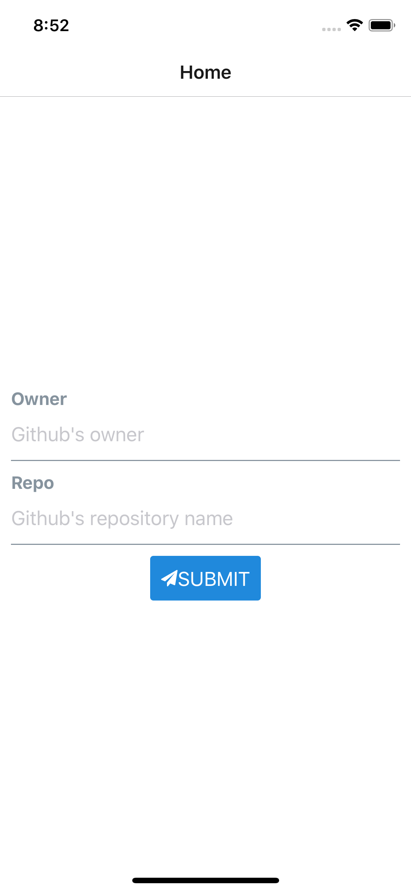
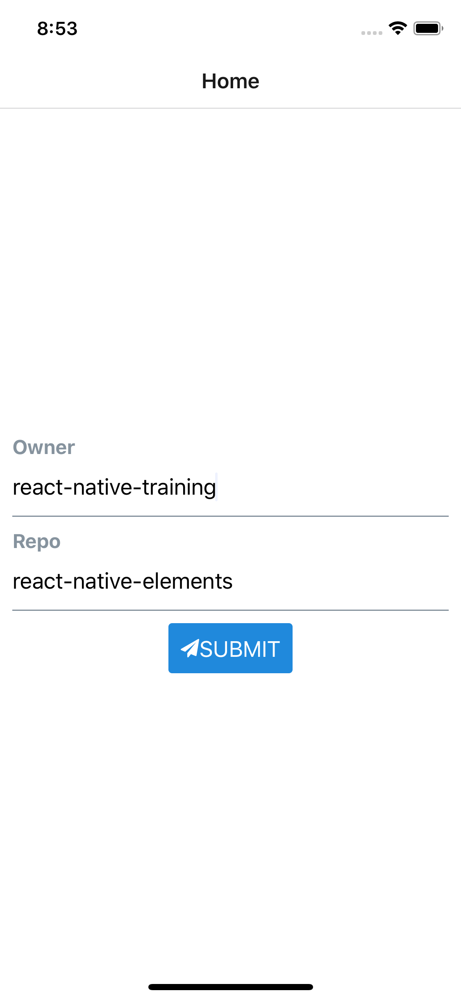
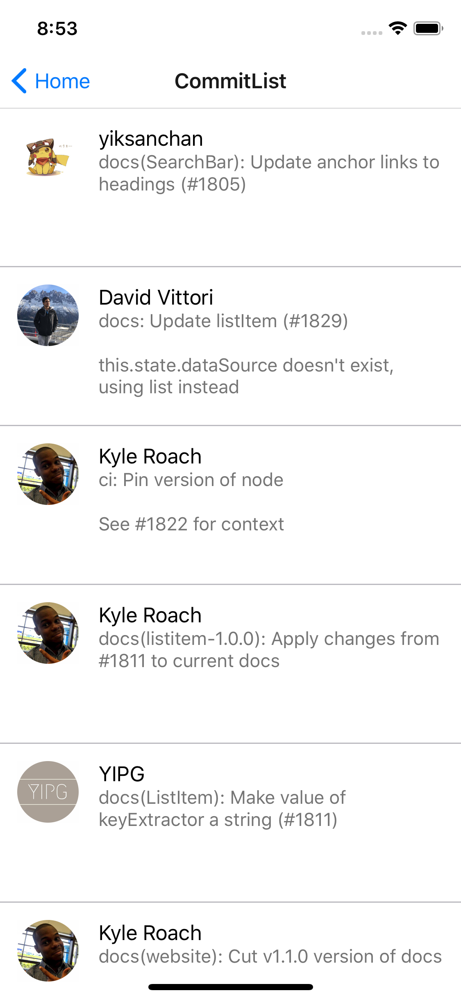

# Gitphone/ReasonML

Reason Version of React Native Elements's Gitphone Case Study: <https://react-native-training.github.io/react-native-elements/blog/2018/12/13/react-native-web.html>

and

<https://levelup.gitconnected.com/comprehensive-guide-to-create-simple-app-using-react-native-web-and-react-native-elements-306cf43fb8d7>

## Loading Fonts into ReactNativeWeb

See <https://github.com/oblador/react-native-vector-icons#web-with-webpack>

